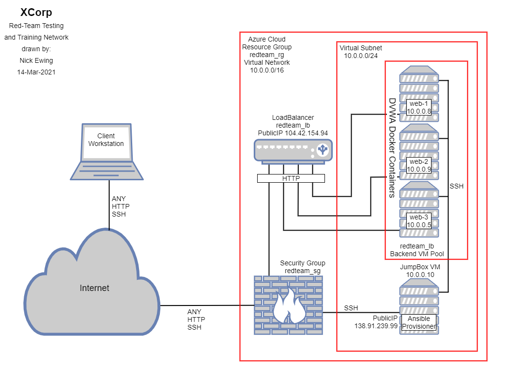
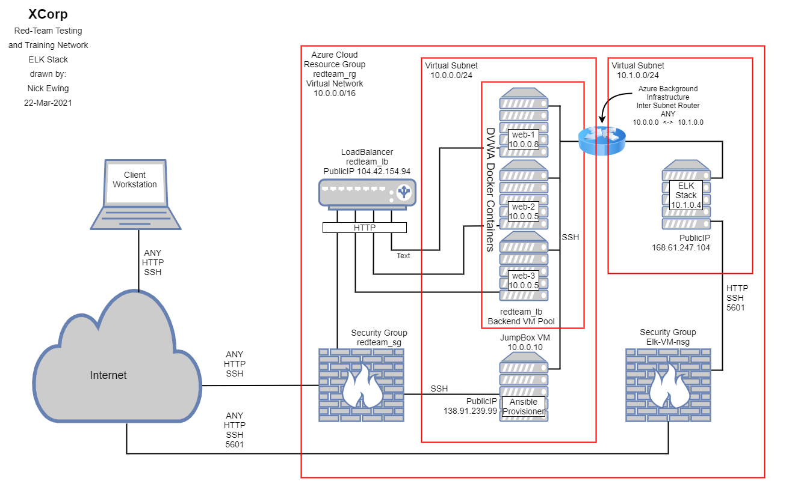

## Microsoft Azure Load Balanced DVWA Deployment / Automated ELK Stack Deployment

The files in this repository represent two parts of an overall project.  In part I, we will build out an Azure Infrastructure as a Service (IaaS) environment that includes cloud networking, firewalls, and virtual computing.  In part II, we continue building upon this environment by adding an ELK VM running Elk Stack to Monitor the DVWA Web VMs

### Part I - Microsoft Azure Load Balanced DVWA Deployment

The main purpose of this network is to expose a load-balanced instance of DVWA, the D*mn Vulnerable Web Application.  The network design consists of a single subnet, three load balanced web server VMs, a jump-box VM providing secure access to the environment as well as managing the provisioning of the Web VMs with Docker and Ansible.  Load balancing ensures that the application will be highly available and fault tolerant, while also restricting unauthorized traffic to the web server VMs in the load balancers backend VM pool.  A single security group (firewall) allows only SSH traffic to the jump box and HTTP traffic to the load balanced pool of Web VMs.  Both the jump box and the load balancer have exposed public IP addresses.  The jump box is further protected by allowing only a single whitelisted IP address access.  Other than providing balanced HTTP traffic to the web VMs, the load balancer is not otherwise exposed.  Additional security is afforded to the jump box by restricting access to only a single SSH256 rsa key pair protected username.  

Docker and Ansible were installed on the jump box and a single container was configured with Ansible to build and configure the Web VMs.  Ansible is a commonly used provisioning tool that can automate the configuration of VMs or containers in our environment.  Ansible is key to supporting our future scalability requirements allowing us to configure potentially thousands of identical machines all at once, and drastically reduce the potential for error.  The use of docker and ansible allow us to follow an Infrastructure as code (IaC) model, which can be used to scale out our design, as well as allowing appropriate administration users to see exactly how the network is configured by reading text files.  Access to the Web VMs is restricted within the subnet (vulnerabilities of DVWA not withstanding) to the containerized Docker / Ansible instance on the Jump Box again, by using a SSH256 rsa key pair protected username on the Web VMs.

In part I of this project, we learned a great deal about using Azure and the Azure Portal.  We configured Azure Resource Groups, Virtual Networks, Network Security Groups, Virtual Machines (CPU, Memory and Disk), Public IP addresses, and Load Balancers.  We configured Network Security Group Inbound Security rules to allow only HTTP and SSH (only from a defined whitelisted IP address) to our Virtual Network.  We installed and configured Docker and Ansible and created Ansible playbooks to manage the deployment of the Web VMs and conform to our IaC model.  We confirmed successful deployment by testing HTTP access to our Web VMs, we systemically shut down certain servers to verify all servers were active and that load balancing was working.  We tested our security rules and configurations by attempting to connect to the network in ways not implicitly permitted.  Finally, we documented our as-built design as well as our playbooks.  More detailed information on addressing, subnets, and access policies will be provided in tables in Part II of this document.

Microsoft Azure Load Balanced DVWA Deployment

### Part II - Automated Elk Stack Deployment

The primary goal of Part II is to add a Cloud Monitoring System by installing and configuring an ELK Stack server VM.  <What is an ELK StacK?>

For added fault tolerance, and due to Azure limitations on free trial accounts, the ELK Stack VM and it's virtual network and other components will be installed in a different Azure Region.  The entire project will stay within the same Resource Group, but will require an additional subnet, Network Security Group (firewall), Public IP address and appropriate Inbound Security Rules.  In the physical world, when an additional subnet is created, a router is required to connect the two subnets together and allow approved traffic to flow between subnets.  In the Azure Virtual environment, this is accomplished by peering the two Virtual Networks.  This creates a background inter subnet router that is not visible to or provisioned within the Azure portal, but nonetheless allows communication between the two subnets.

Although not completely necessary, but nice for learning, I've opened SSH to the ELM-VM, in addition to HTTP and port 5601 which is required by Kibana.  As in part I, we have configured network security group inbound security riles to only allow SSH from the previous whitelisted IP address.  HTTP and port 5601 are open and exposed through ELM VMs public IP address.  Upon completion of Azure configuration of the Virtual Network, Security Group, Virtual Network Peering, Virtual Machine and public IP address, the remainder of the ELK Stack VM will be configured using Docker and Ansible from the Jump Box.  

For this implementation, I created three ansible playbooks.  One to create the container and install the ELK stack, one to install filebeat and one to install metricbeat.  I'll discuss filebeat and metricbeat later in this document.  The install_elk.yml playbook uses Ansible to automatically install and configure Docker and Python on the ELK VM.  Then Docker is started and a preconfigured ELK Stack container is loaded.  Finally, this playbook completes the configuration of the ELK VM with system settings and setting Docker to start at boot.  There is no manual configuration (after built with Azure) required to complete this process.  This again, allows us to follow our IaC model and avoid costly human errors.  At this point, the ELK stack is running on the VM, which we can verify by connecting to Kibana on port 5601.  Although the ELK stack is successfully installed and running, we are not yet able to collect any data.

In order to collect data for the ELK stack, we need to install additional software, known as Beats on the Web-VMs and point them to the ELK VM.  Beats are an open platform for single-purpose data shippers.  They send data from hundreds or even thousands of machines and systems to Logstash or Elasticsearch.  For our purposes, we've select Filebeat and Metricbeat to perform our data collection on the Web VMs and upload to the ELK VM.  Filebeat is a tool that allows you to forward and centralize logs and files in the ELK Stack.  Metricbeat is a tool that allows you to collect and forward metrics from systems and services to the ELK Stack.

Automated ELK Stack Deployment

### Appendix

### Ansible Playbook Files

[Configure Web VMs](ansible/pentest.yml)

[Install ELK Stack](ansible/install_elk.yml)

[Install Filebeat](ansible/filebeat-playbook.yml)

[Install Metricbeat](ansible/metricbeat-playbook.yml)

These files have been tested and used to generate the full environment on Azure (Less Azure Configuration). They can be used to either recreate the entire deployment described above.

This appensix document contains the following details:
- Description of the Topology
- Access Policies
- ELK Configuration
  - Beats in Use
  - Machines Being Monitored
- How to Use the Ansible Build

### Description of the Topology

The configuration details of each machine may be found below.

| Name     | Function | IP Address | Operating System |
|----------|----------|------------|------------------|
| Jump Box | Gateway  | 10.0.0.1   | Linux            |
| TODO     |          |            |                  |
| TODO     |          |            |                  |
| TODO     |          |            |                  |

### Access Policies

The machines on the internal network are not exposed to the public Internet.

Only the _____ machine can accept connections from the Internet. Access to this machine is only allowed from the following IP addresses:
- _TODO: Add whitelisted IP addresses_

Machines within the network can only be accessed by _____.
- _TODO: Which machine did you allow to access your ELK VM? What was its IP address?_

A summary of the access policies in place can be found in the table below.

| Name     | Publicly Accessible | Allowed IP Addresses |
|----------|---------------------|----------------------|
| Jump Box | Yes/No              | 10.0.0.1 10.0.0.2    |
|          |                     |                      |
|          |                     |                      |

### Elk Configuration

Ansible was used to automate configuration of the ELK machine. No configuration was performed manually, which is advantageous because...
- _TODO: What is the main advantage of automating configuration with Ansible?_

The playbook implements the following tasks:
- _TODO: In 3-5 bullets, explain the steps of the ELK installation play. E.g., install Docker; download image; etc._
- ...
- ...

The following screenshot displays the result of running `docker ps` after successfully configuring the ELK instance.

### Target Machines & Beats
This ELK server is configured to monitor the following machines:
- _TODO: List the IP addresses of the machines you are monitoring_

We have installed the following Beats on these machines:
- _TODO: Specify which Beats you successfully installed_

These Beats allow us to collect the following information from each machine:
- _TODO: In 1-2 sentences, explain what kind of data each beat collects, and provide 1 example of what you expect to see. E.g., `Winlogbeat` collects Windows logs, which we use to track user logon events, etc._

### Using the Playbook
In order to use the playbook, you will need to have an Ansible control node already configured. Assuming you have such a control node provisioned:

SSH into the control node and follow the steps below:
- Copy the _____ file to _____.
- Update the _____ file to include...
- Run the playbook, and navigate to ____ to check that the installation worked as expected.

_TODO: Answer the following questions to fill in the blanks:_
- _Which file is the playbook? Where do you copy it?_
- _Which file do you update to make Ansible run the playbook on a specific machine? How do I specify which machine to install the ELK server on versus which to install Filebeat on?_
- _Which URL do you navigate to in order to check that the ELK server is running?

_As a **Bonus**, provide the specific commands the user will need to run to download the playbook, update the files, etc._
