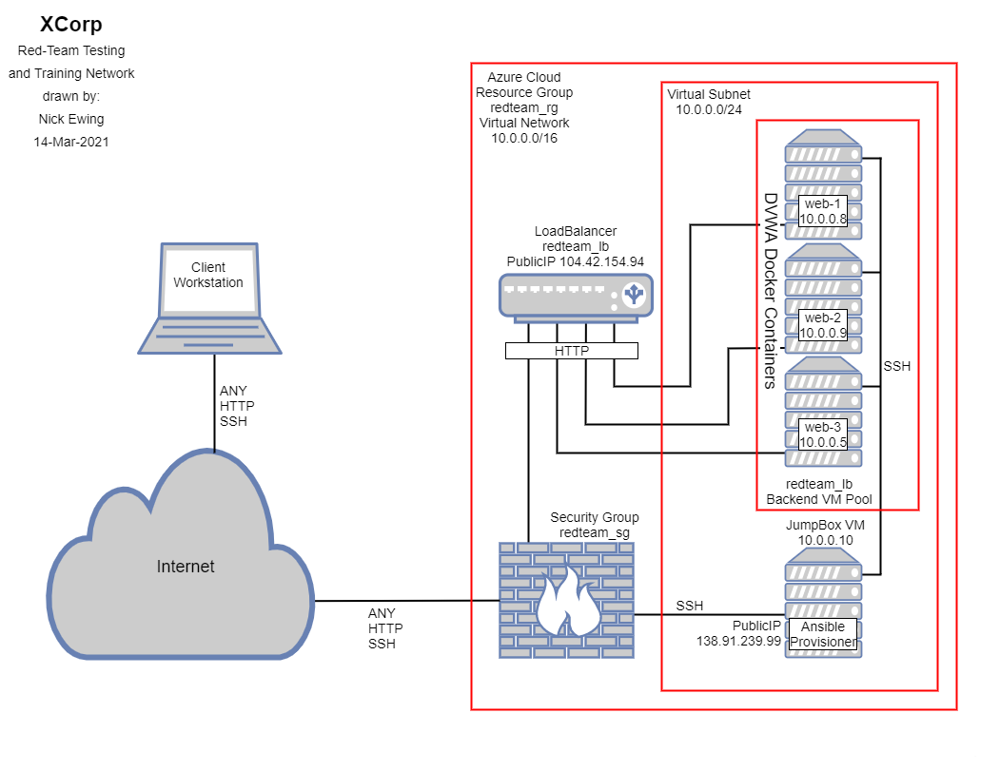
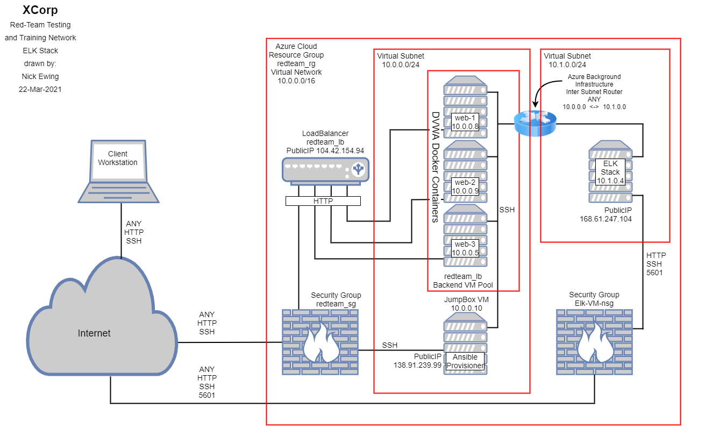

## Microsoft Azure Load Balanced Web Server Deployment / Automated ELK Stack Deployment

The files in this repository represent two parts of an overall project.  In part I, we built out an Azure Infrastructure as a Service (IaaS) environment that includes cloud networking, firewalls, and virtual computing.  In part II, we continue building upon this environment by adding an ELK VM running Elk Stack to Monitor the DVWA Web VMs
  

### Part I - Microsoft Azure Load Balanced Web Server Deployment

The main purpose of this network is to expose a load-balanced Web Server Environment.  In this project we used DVWA, the D*mn Vulnerable Web Application as our Web Server application.  The network design consists of a single subnet, three load balanced web server VMs, a jump-box VM providing secure access to the environment as well as managing the provisioning of the Web VMs with Docker and Ansible.  Load balancing ensures that the application will be highly available and fault tolerant, while also restricting unauthorized traffic to the web server VMs in the load balancers backend VM pool.  A single security group (firewall) allows only SSH traffic to the jump box and HTTP traffic to the load balanced pool of Web VMs.  Both the jump box and the load balancer have exposed public IP addresses.  The jump box is further protected by allowing only a single whitelisted IP address access.  Other than providing balanced HTTP traffic to the web VMs, the load balancer is not otherwise exposed.  Additional security is afforded to the jump box by restricting access to only a single SSH256 rsa key pair protected username.  

Docker and Ansible were installed on the jump box and a single container was configured with Ansible to build and configure the Web VMs.  Ansible is a commonly used provisioning tool that can automate the configuration of VMs or containers in our environment.  Ansible is key to supporting our future scalability requirements allowing us to configure potentially thousands of identical machines all at once, and drastically reduce the potential for error.  The use of Docker and Ansible allow us to follow an Infrastructure as code (IaC) model, which can be used to scale out our design, as well as allowing appropriate administration users to see exactly how the network is configured by reading text files.  Non HTTP access to the Web VMs is restricted within the subnet (vulnerabilities of DVWA not withstanding) to the containerized Docker / Ansible instance on the Jump Box again, by using a SSH256 rsa key pair protected username on the Web VMs.

In part I of this project, we gained significant hands on experience using Azure and the Azure Portal.  We configured Azure Resource Groups, Virtual Networks, Network Security Groups, Virtual Machines (CPU, Memory and Disk), Public IP addresses, and Load Balancers.  We configured Network Security Group Inbound Security rules to allow only HTTP and SSH (only from a defined whitelisted IP address) to our Virtual Network.  We installed and configured Docker and Ansible and created Ansible playbooks to manage the deployment of the Web VMs and conform to our IaC model.  We confirmed successful deployment by testing HTTP access to our Web VMs, we systemically shut down certain servers to verify all servers were active and that load balancing was working.  We tested our security rules and configurations by attempting to connect to the network in ways not implicitly permitted.  Finally, we documented our as-built design as well as our playbooks.  More detailed information on addressing, subnets, and access policies will be provided in tables in the Appendix of this document.
  

Microsoft Azure Load Balanced DVWA Deployment
  

### Part II - Automated Elk Stack Deployment

The primary goal of Part II is to add a Cloud Monitoring System by installing and configuring an ELK Stack server VM.  The ELK StacK, also known as the Elastic Stack is an open source project that reliably and securely takes data from any source, in almost any format, and allows you to search, analyze, and visualize it in real time.  ELK is the acronym for three open source projects:  Elasticsearch, Logstash, and Kibana.  Elasticsearch is a distributed, RESTful, JSON-based search and analytics engine.  Logstash is a server-side data processing engine that ingests data from multiple sources simultaneously, transforms it, and then sends it to Elasticsearch.  Kibana allows users to visualize data with charts and graphs in Elasticsearch. [Courtesy elastic.co]

For added fault tolerance, and due to Azure limitations on free trial accounts, the ELK Stack VM and it's virtual network and other components will be installed in a different Azure Region.  The entire project will stay within the same Resource Group, but will require an additional subnet, Network Security Group (firewall), Public IP address and appropriate Inbound Security Rules.  In the physical world, when an additional subnet is created, a router is required to connect the two subnets together and allow approved traffic to flow between subnets.  In the Azure Virtual environment, this is accomplished by peering the two Virtual Networks.  This creates a background inter subnet router that is not visible to or provisioned within the Azure portal, but nonetheless allows communication between the two subnets.

Although not completely necessary, but nice for learning, we have opened SSH to the ELM-VM, in addition to HTTP and port 5601 which is required by Kibana.  As in part I, we have configured network security group inbound security rules to only allow SSH from the previous whitelisted IP address.  HTTP and port 5601 are open and exposed through ELK VMs public IP address.  Upon completion of Azure configuration of the Virtual Network, Security Group, Virtual Network Peering, Virtual Machine and public IP address, the remainder of the ELK Stack VM will be configured using Docker and Ansible from the Jump Box.  

For this implementation, we created three ansible playbooks.  One to create the container and install the ELK stack, one to install filebeat and one to install metricbeat.  We will discuss filebeat and metricbeat later in this document.  The install_elk.yml playbook uses Ansible to automatically install and configure Docker and Python on the ELK VM.  Then Docker is started and a preconfigured ELK Stack container is loaded.  Finally, this playbook completes the configuration of the ELK VM with system settings and setting Docker to start at boot.  There is no manual configuration (after built with Azure) required to complete this process.  This again, allows us to follow our IaC model and avoid costly human errors.  At this point, the ELK stack is running on the VM, which we can verify by connecting to Kibana on port 5601.  Although the ELK stack is successfully installed and running, we are not yet able to collect any data.

In order to collect data for the ELK stack, we need to install additional software, known as Beats on the Web-VMs and point them to the ELK VM.  Beats are an open platform for single-purpose data shippers.  Beats reside on servers, within containers and are extremely lightweight.  They send data from hundreds or even thousands of machines and systems to Logstash or Elasticsearch.  For our purposes, we've select Filebeat and Metricbeat to perform our data collection on the Web VMs and upload to the ELK VM.  Filebeat is a tool that allows you to forward and centralize logs and files in the ELK Stack.  Metricbeat is a tool that allows you to collect and forward metrics from systems and services to the ELK Stack.

In part II of this project, we exercised our Azure and Ansible skills further, learned about the ELK stack and beats, and learned how to monitor the web environment using Kibana within the ELK stack.  We also learned troubleshooting, IP addressing, port based firewall configuration and basic network routing.  We collected all of our resources as built and created a GitHub repository to store and share the work that we completed.  In this process we also learned about markdown notation.
  

Automated ELK Stack Deployment
  

### Appendix

### Ansible Playbook Files

These files have been tested and used to generate the full environment on Azure (Less Azure Configuration). They can be used to either recreate the entire deployment described above.  Reference the README file in the ansible folder for additional information on each playbook.

[Configure Web VMs](ansible/pentest.yml)

[Install ELK Stack](ansible/install_elk.yml)

[Install Filebeat](ansible/filebeat-playbook.yml)

[Install Metricbeat](ansible/metricbeat-playbook.yml)

### Azure VM Overview

The Internal IP and Operating System details:

| Name      | Function  | IP Address | Operating System |
|-----------|-----------|------------|------------------|
| Jump Box  | Gateway   | 10.0.0.10  | Linux            |
| Web-1     | DVWA      | 10.0.0.8   | Linux            |
| Web-2     | DVWA      | 10.0.0.9   | Linux            |
| Web-3     | DVWA      | 10.0.0.5   | Linux            |
| ELK Stack | ELK Stack | 10.1.0.4   | Linux            |

The Public / Exposed IP Address details:

| Name      | Public IP Address | Accepted Ports  |
|-----------|-------------------|-----------------|
| Jump Box  | 138.91.239.99     | SSH             |
| Load Bal  | 104.42.154.94     | HTTP            |
| ELK Stack | 168.61.247.104    | HTTP, SSH, 5601 |

Access to the Web-VMs is available through the Load Balancer.

### Access Policy Summary

All of the VMs have a private IP address in the 10.0.0.0/16 network space.  These addresses are not exposed to the public internet.

All of the Public / Exposed IP Addresses have been further restricted to only allow connection from a specific, whitelisted IP adress.

### Using the Playbooks

In order to use the playbooks, you will need to have your Azure Environment built and already configured. Be certain that your jump box has Docker installed and that you have pulled the correct Ansible Control Node container from docker hub (cyberxsecurity/ansible)

Docker / Ansible Installation on Jump box
1. sudo apt update
2. sudo apt install docker.io
3. sudo systemctl status Docker
4. sudo systemctl start docker (if necessary)
5. sudo docker pull cyberxsecurity/ansible
6. sudo docker run -ti -name ansible cyberxsecurity/ansible:latest bash (only once)
7. sudo docker start ansible
8. sudo docker attach ansible

SSH into the Jump Box (Ansible Control Node) and follow the steps below:
1. Start the Ansible Control Node container (steps 7-8 above if necessary)
2. Inside the container:
* Copy the ansible playbook .yml files to /etc/ansible
* Update the /etc/ansible/hosts file to include the groupings of your systems (webserver or elk) along with their IP addresses
* Run the playbooks using the command "ansible-playbook <playbook>.yml"
* Use the command "ansible all -m ping" to check that the installation worked as expected.

You now have an environment to demonstrate the design that was built for this project.
